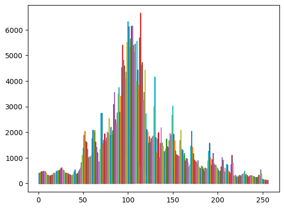
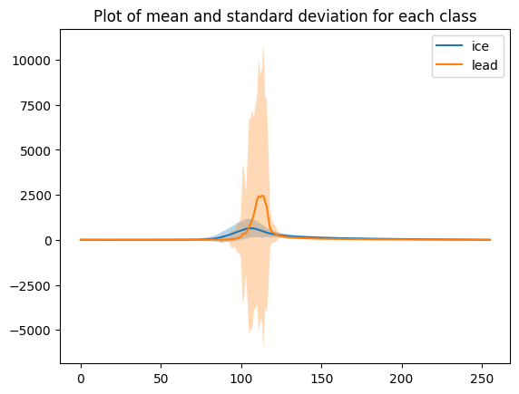

# week4-unsupervised-learning-esa-echo-classification
Week 4 Assignment for Unsupervised Learning: Classifying SRAL echoes into categories of sea ice and leads utilizing Gaussian Mixture Models (GMM), alongside a comparison with official labels from the European Space Agency (ESA).
# GEOL0069 – Week 4: Unsupervised Learning for Altimetry Echo Classification

## Overview

This repository contains the Week 4 assignment for the UCL module **GEOL0069 – Artificial Intelligence for Earth Observation**.  
The objective of this assignment is to apply **unsupervised learning methods**, specifically **Gaussian Mixture Models (GMM)**, to classify **Sentinel-3 SRAL altimetry echoes** into **sea ice** and **lead** surfaces.

The analysis builds upon the notebook provided in the course material:  
`Chapter1_Unsupervised_Learning_Methods_Michel.ipynb`.

---

## 1. Context and Data

Satellite radar altimeters such as **Sentinel-3 SRAL** measure the shape and strength of radar echoes reflected from the Earth's surface.  
Different surface types (e.g. rough sea ice versus smooth leads) produce distinct echo waveforms due to differences in surface roughness and reflectivity.

The figure below shows a selection of raw altimetry echo waveforms used in this study, highlighting the large variability in echo shape and amplitude.

*Figure 1. A selection of raw Sentinel-3 altimetry echo waveforms, illustrating the diversity of echo shapes prior to classification.*

---

## 2. Methodology: Unsupervised Learning with GMM

To separate sea ice and lead echoes without using labelled training data, a **Gaussian Mixture Model (GMM)** was applied.  
GMMs are well suited to this problem because they provide **soft clustering**, allowing each echo to be assigned a probability of belonging to each class.

The model was configured with **two Gaussian components**, corresponding to:
- Sea ice echoes  
- Lead echoes
The choice of two components was motivated by the expected bimodal nature of the echo population corresponding to sea ice and leads.
Following preprocessing and cleaning of the echo data, the GMM was fitted and cluster labels were assigned to each echo waveform.

---

## 3. Results: Mean and Standard Deviation of Echoes

After clustering, the **mean echo shape** and **standard deviation** were calculated separately for sea ice and lead echoes.

The figure below shows that lead echoes exhibit a **sharper and stronger peak**, while sea ice echoes display a broader and more gradual decay.  
The standard deviation indicates **greater variability in lead echoes**, consistent with the dynamic and heterogeneous nature of leads.

*Figure 2. Mean echo waveform and standard deviation for sea ice and lead classes derived from the GMM classification.*

---

## 4. Comparison with ESA Classification

To assess the performance of the unsupervised classification, the GMM-derived labels were compared with the **official ESA surface classification flags** using a **confusion matrix**.

This comparison shows good agreement between the unsupervised GMM results and the ESA labels, demonstrating that GMMs can effectively separate sea ice and lead echoes using waveform characteristics alone.

*(Confusion matrix generated within the notebook.)*

---

## 5. Jupyter Notebook

The full data processing workflow, GMM implementation, visualisations, and confusion matrix analysis are available in the Jupyter notebook:

- `Unit_2_Unsupervised_Learning_Methods.ipynb`

This notebook was executed using **Google Colab**, with data accessed via Google Drive.

---

## Acknowledgements

This project was completed as part of the **GEOL0069 – Artificial Intelligence for Earth Observation** module at **UCL Earth Sciences**.
